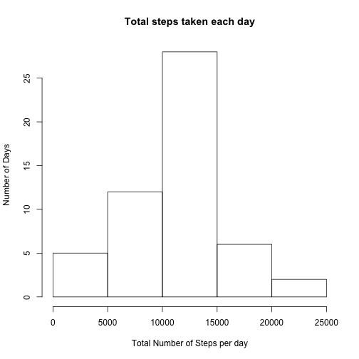
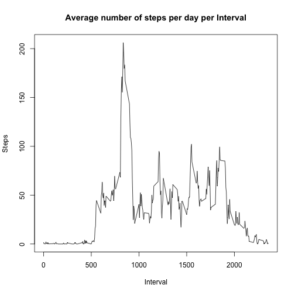
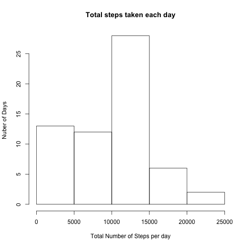
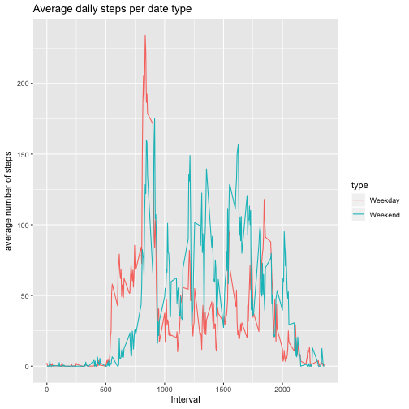

#Reproducible Research Week 2 Project:
##Writing a Markdown file

###Reading the data:

```r
setwd("~/Desktop/Reproducible Research")
data <- read.csv("activity.csv")
```

###Getting the sum of steps per day

```r
steps <- aggregate(steps ~ date , data, sum)
```

###Creating a histogram of total steps per day

```r
hist(steps$steps, main= "Total steps taken each day",xlab= "Total Number of Steps per day",ylab="Number of Days")
```



###Getting the mean and median of steps per day

```r
dmean <- mean(steps$steps) 
dmedian <- median (steps$steps)
```

###The Mean number of steps per day is 1.0766189 &times; 10<sup>4</sup> while the median number of steps is 10765.


###Time series plot of average steps taken each day

```r
steps_i <- aggregate(steps ~ interval, data, mean)
with(steps_i,plot(interval,steps, type="l",xlab="Interval",ylab="Steps",main="Average number of steps per day per Interval" ))
```



```r
max <- steps_i[which.max(steps_i$steps),1]
```

###The maximum value of steps is 835. 

###Getting the number of NA from the original dataset

```r
blank <-sum(is.na(data$steps))
```
### There are 2304 NA values in the dataset.

###Imputing missing values by getting the median per interval

```r
steps_i2 <- aggregate(steps ~ interval, data, median)
```

###Computing for the median values and transforming the data by filling the missing values with the median.

```r
match <- steps_i2$steps[match(data$interval,steps_i2$interval)]
impute <- transform(data, steps = ifelse(is.na(data$steps),match,data$steps))
```

###Getting the sum of steps per day using the transformed data

```r
steps2 <- aggregate(steps ~ date , impute, sum)
```

###Creating a histogram of total steps per day using the transformed data

```r
hist(steps2$steps, main= "Total steps taken each day",xlab= "Total Number of Steps per day",ylab="Nuber of Days")
```



###Getting the mean and median of the transformed data

```r
dmean2 <- mean(steps2$steps) 
dmedian2 <- median (steps2$steps)
```

###The Mean number of steps per day is 9503.8688525 while the median number of steps is 10395.


###Classifying the date to a weekend or weekday

```r
data$date <- as.Date(data$date)
data$type <- sapply(data$date,function(x){
    if(weekdays(x)=="Saturday" | weekdays(x)=="Sunday")
       {z <-"Weekend"}
    else {z <-"Weekday"}
})
```

###Comparing the average number of steps taken per 5-minute interval across weekdays and weekends

```r
ww <- aggregate (steps ~ interval + type, data,mean, na.rm=TRUE)


library(ggplot2)
ggplot(ww, aes(interval, steps, color = type)) +
  geom_line() +
  xlab("Interval") +
  ylab(expression("average number of steps")) +
  ggtitle('Average daily steps per date type')
```



